# Sisäänpääsytentti 2016 {#Sisaanpaasytentti2016}

Tentti koostui väittämistä, joiden perään piti merkata oliko väittämä **oikein/väärin.** Ainakin 2017 oli sama sisäänpääsytentti ja näin oletettavasti ollut myös seuraavina vuosina. 2021 ollut ilmeisesti lisää kysymyksiä ja nämä käsitellään seuraavassa kappaleessa.

## Kolmen kuuloluun nimet ovat vasara (malleus), alasin (incus) ja jalustin (stapes)

  <button class="solution-button" data-label="Vastaus" data-hide-label="Piilota vastaus">
    Vastaus
  </button>
  

      O
      
MIS VAJ (malleus, incus, stapes = vasara, alasin, jalustin)

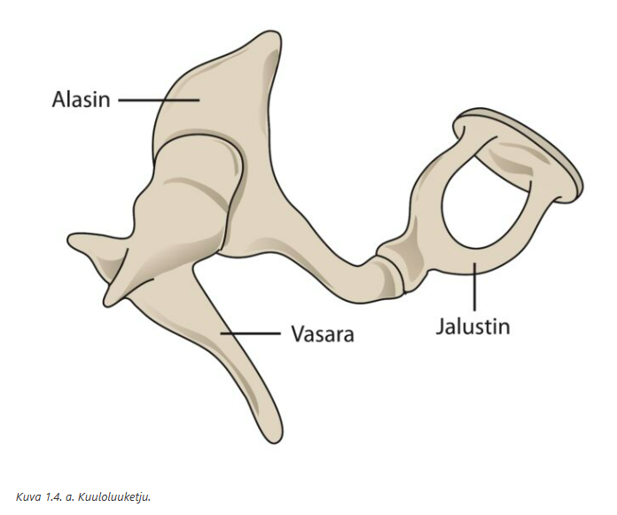
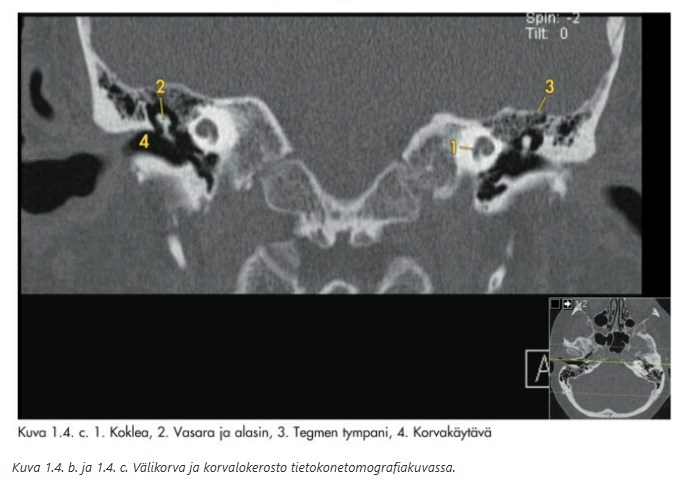
  

## Kuuloluista vasara on kiinni soikeassa ikkunassa ja kuuloluista mediaalisimpana

  <button class="solution-button" data-label="Vastaus" data-hide-label="Piilota vastaus">
    Vastaus
  </button>
  

      V
      
Lateraalisesta mediaaliseen: MIS VAJ (malleus, incus, stapes = vasara, alasin, jalustin). Jalustin on siis mediaalisin kuuloluu ja kiinni soikeassa ikkunassa (fenestra ovale).

Jalustin siis välittää kuuloluiden liikettä soikean ikkunan kautta koklean sisälle scala vestibulin nesteeseen. Tämä aiheuttaa basilaarimembraanin aaltoiltua ja lopulta äänisignaalin synnyn. Tämä johtaa koklean stereosilioiden taipumiseen, jolloin karvasolut depolarisoituvat ja tämä johtaa stimulukseen äänihermoon. 

Älä sekoita soikeaa ikkunaa pyöreään ikkunaan. Soikeasta ikkunasta posterioinferiorisesti sijaitsee ns. pyöreä ikkuna, joka mahdollistaa sen, että jalustimen aiheuttama työntö siirtyy perilymfaan (soikea ikkuna on joustava ja luo siten tilaa perilymfan liikkeelle). 

Äärettömän hyvä animaatio äänen transduktiosta: https://youtu.be/PeTriGTENoc?si=_79KmpFlPrMCHy5S

  

## Stapediuslihaksen supistuminen jäykistää kuuloluuketjua antaen siten suojaa voimakkailta ääniltä

  <button class="solution-button" data-label="Vastaus" data-hide-label="Piilota vastaus">
    Vastaus
  </button>
  

      O
      
Kuuloluuketjuun kiinnittyy lisäksi kaksi lihasta: m. tensor tympani vasaran kaulaan ja m. stapedius jalustimen kaulaan.
      
Stapediuslihaksen supistuminen jäykistää kuuloluuketjua ja tilttaa anteriorista jalustinta poispäin soikeasta ikkunasta, mikä vähentää äänienergian siirtymistä sisäkorvaan antaen siten suojaa voimakkailta ääniltä. 

Tensor tympani -lihaksen tehtävänä on lähinnä tukea tärykalvoa ja kuuloluuketjua mekaanisesti. Ei ole roolissa akustisessa refleksissä.

  

## Stapediusrefleksin laukeamiskynnys äänille on normaalisti 20-30 dB

  <button class="solution-button" data-label="Vastaus" data-hide-label="Piilota vastaus">
    Vastaus
  </button>
  

      V
      
Stapediusrefleksin (a.k.a. akustinen refleksi eli m. stapediuksen supistuminen vasteena kovalle äänelle) laukeamiskynnys ääneksille on tavallisesti **70–90 dB tasolla,** leveäkaistaiselle äänelle toistakymmentä desibeliä vähemmän.
  

## Korvatorvi (tuba Eustachii) yhdistää välikorvaontelon nenänieluun

  <button class="solution-button" data-label="Vastaus" data-hide-label="Piilota vastaus">
    Vastaus
  </button>
  

      O

Korvatorvella on tärkeä merkitys välikorvaontelon eritteen poistumisessa, sekä välikorvan ja kartiolisäkkeen lokeroston ilmastoinnissa.

Korvatorven välikorvanpuoleinen kolmannes on luinen ja nenänielupuoleiset kaksi kolmannesta ovat rustoisia. Korvatorven rustoiseen osaan kiinnittyvistä lihaksista tärkein on m. tensor veli palatini. Sen supistuminen avaa korvatorvea nielemisen ja haukottelun aikana.

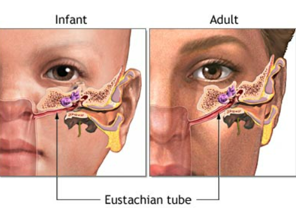
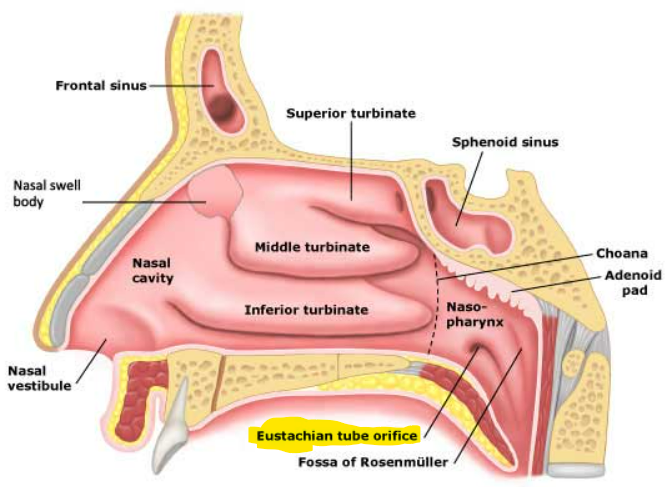
  

## Vestibulo-okulaarinen refleksi aiheuttaa pään liikkeen kanssa yhtä suuren, samansuuntaisen silmänliikkeen

  <button class="solution-button" data-label="Vastaus" data-hide-label="Piilota vastaus">
    Vastaus
  </button>
  

      V

Tasapainoelin-silmäheijaste, vestibulo-okulaarinen refleksi (VOR, okulovestibulaarinen refleksi) pitää pään liikkuessa katseen vakaana siten, että refleksi aiheuttaa pään liikkeen kanssa yhtä suuren, mutta vastakkaissuuntaisen silmänliikkeen. VOR on hallitseva järjestelmä nopeiden päänliikkeiden aikana.

Voidaan testata mm. kalorisella kokeella (useimmiten vain kylmävesikalorisaatio eli jäävesikoe, mutta on myös lämminvesikalorisaatiotesti olemassa). Siinä potilas makaa selällään pää noin 30 astetta koholla ja korvakäytävään tiputetaan 0-asteista vettä. Samalla seurataan mahdollisen nystagmuksen ilmaantumista käyttäen Frenzelin laseja. Usein vaste tulee jo 0,2 ml:lla vettä, jolloin nähdään vastakkaisen korvan suuntaan lyövä nystagmus. Tarvittaessa annos voidaan nostaa 0,4 ml:aan, jolloin suurimmalla osalla tutkittavista nähdään nystagmus. Jos vastetta ei saada edes 20 ml:lla, niin kalorinen vaste voidaan katsoa sammuneeksi. Tasapainoelimen toiminnan tarkempi tutkimus suoritetaan erikoissairaanhoidossa.

Päännykäisy- eli impulssitestillä (Head Impulse Test, HIT) mitataan myös vestibulaari-okulaarirefleksin toimintaa. Testiä voidaan käyttää esimerkiksi vestibulaarineuriitin diagnostiikassa. Testissä tutkittava istuu tai on selällään sängyssä. Tutkittavaa pyydetään kiinnittämän katseensa joko edessä olevan tutkijan nenän päähän tai seinällä olevaan pisteeseen ja pitämään katseen kohteessa samalla kuin nopeasti käännetään tutkittavan päätä sivulle 10–20 astetta. Tutkija seuraan tutkittavan silmiä. Normaalisti tutkittava pystyy pitämään katseensa paikoillaan ilman korjaavaa sakadiliikettä. Tämä kuvastaa normaalia vestibulaari-okulaarirefleksiradan toimintaa. Heikentyneessä tai puuttuvassa vasteessa silmät liikkuvat pään käännön suuntaan ja korjausliikkeellä palaavat alkuperäiseen kohteeseensa. Poikkeava vestibulaari-okulaarirefleksi on sillä puolella, minne puolelle päätä kääntäessä silmien korjaava sakadiliike ilmaantui.

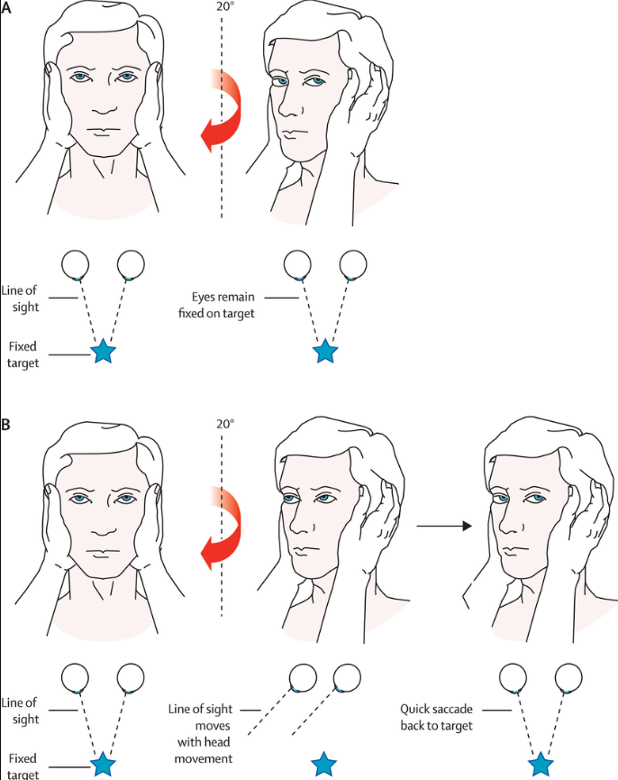

VOR-testaukset kuuluvat aivokuolleen potilaan kriteereihin. Kun potilas ei hengitä, on koomassa ja häneltä puuttuu aivorunkoheijasteet (valorefleksi, okulovestibulaarinen refleksi, kornearefleksi, yökkäysrefleksi ja yskärefleksi), voidaan potilas todeta aivokuolleeksi. 

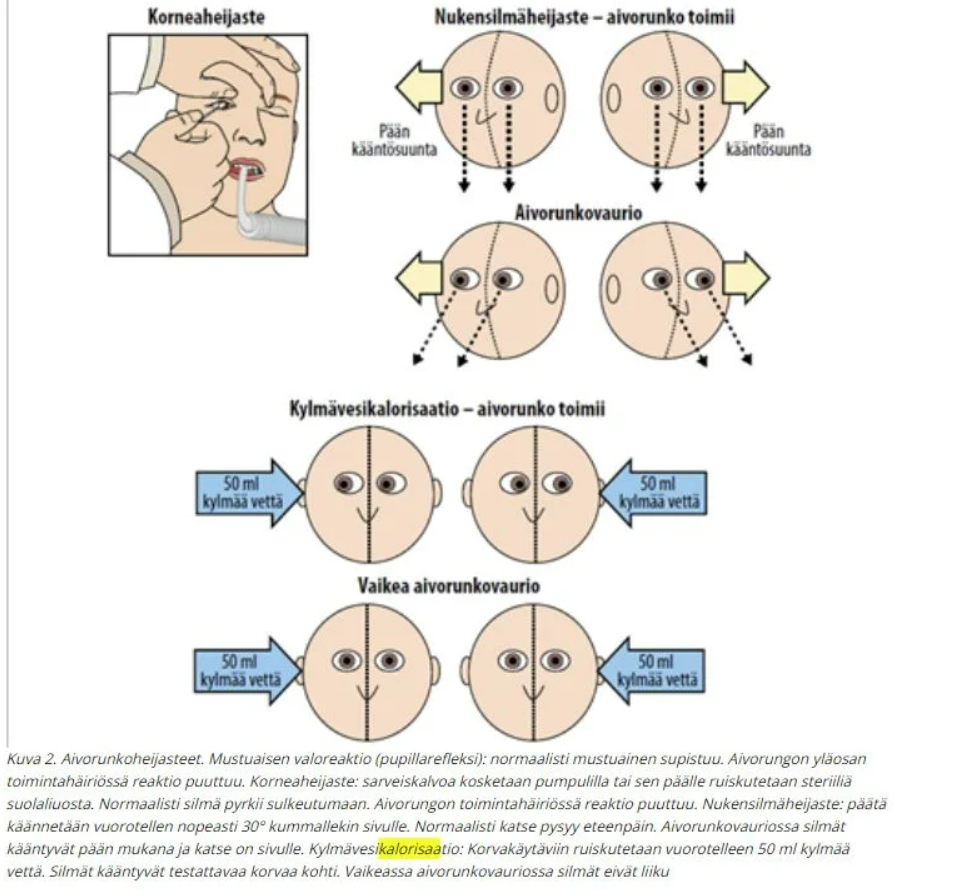
  

## Normaalissa kuulossa Weberin testi ei lateraalistu ja Rinnen testi on positiivinen

  <button class="solution-button" data-label="Vastaus" data-hide-label="Piilota vastaus">
    Vastaus
  </button>
  

      O

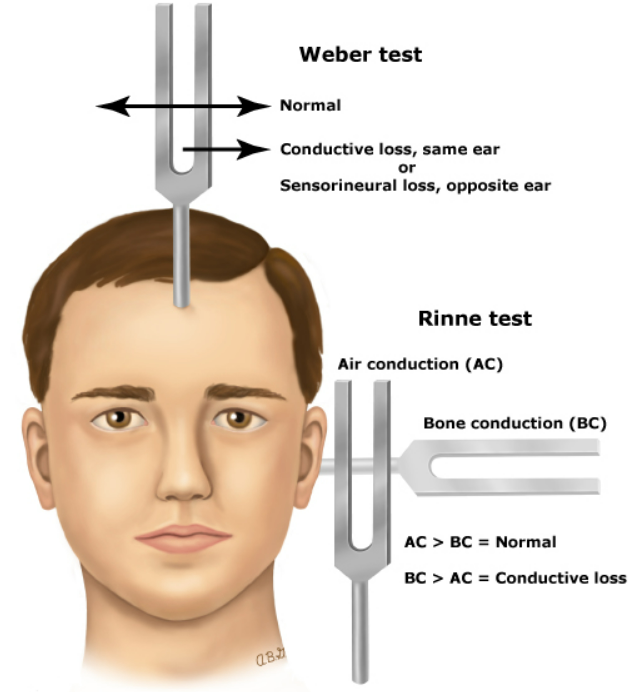
  

## Päännykäisy- eli impulssitestillä mitataan vestibulaari-okulaari –refleksin toimintaa

  <button class="solution-button" data-label="Vastaus" data-hide-label="Piilota vastaus">
    Vastaus
  </button>
  

      O
      
Tasapainoelin-silmäheijaste, vestibulo-okulaarinen refleksi (VOR, okulovestibulaarinen refleksi) pitää pään liikkuessa katseen vakaana siten, että refleksi aiheuttaa pään liikkeen kanssa yhtä suuren, mutta vastakkaissuuntaisen silmänliikkeen. VOR on hallitseva järjestelmä nopeiden päänliikkeiden aikana.

Impulssitestissä tutkittava istuu tai on selällään sängyssä. Tutkittavaa pyydetään kiinnittämän katseensa joko edessä olevan tutkijan nenän päähän tai seinällä olevaan pisteeseen ja pitämään katseen kohteessa samalla kuin nopeasti käännetään tutkittavan päätä sivulle 10–20 astetta. Tutkija seuraan tutkittavan silmiä. Normaalisti tutkittava pystyy pitämään katseensa paikoillaan ilman korjaavaa sakadiliikettä. Tämä kuvastaa normaalia vestibulaari-okulaarirefleksiradan toimintaa. Heikentyneessä tai puuttuvassa vasteessa silmät liikkuvat pään käännön suuntaan ja korjausliikkeellä palaavat alkuperäiseen kohteeseensa. Poikkeava vestibulaari-okulaarirefleksi on sillä puolella, minne puolelle päätä kääntäessä silmien korjaava sakadiliike ilmaantui.

Toinen VOR-testi olisi kalorisaatio (esim. kylmävesikalorisaatio, jossa korvaan laitetaan kylmää vettä ja normaalisti havaitaan vastakkaisen korvan suuntaan lyövä nystagmus).

  

## Ulkonenän tukirakenteesta 1/3 on luuta ja 2/3 rustoa

  <button class="solution-button" data-label="Vastaus" data-hide-label="Piilota vastaus">
    Vastaus
  </button>
  

      O

Ulkonenän pyramidin yläosan muodostavat kaksi nenäluuta, jotka kiinnittyvät frontaaliluuhun. Pyramidin sivuosan muodostavat yläleuanluun processus frontalikset. Luiden rajaamaa nenäaukkoa nimitetään apertura piriformikseksi. 

Nenäluut kiinnittyvät rustoon ohuiden sidekudossäikeiden avulla. Ylälateraalirusto muodostaa ulkonenän rustoisen yläosan. Alaosan muodostavat symmetriset, kaaren muotoiset parilliset alaarirustot, joissa erotetaan mediaalinen ja lateraalinen osa (crus mediale ja crus laterale) ja niiden välissä nenänpäätä muovaava ns. välihaara. Crus medialet, sidekudos ja iho muodostavat nenän etuosan ns. kolumellan. Kolumellan takaa alkaa nenän väliseinä. 

Nenän väliseinä on syvyyssuunnassa noin 7 cm mittainen. Nenäkäytävät avautuvat nenänieluun koaaniaukkoina.

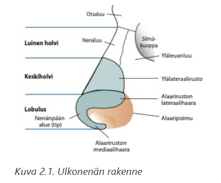
  

## Nenässä on viisi pari pieniä, nenän toimintaan vaikuttavia lihaksia

  <button class="solution-button" data-label="Vastaus" data-hide-label="Piilota vastaus">
    Vastaus
  </button>
  

      O

M. dilatator avaa sierainaukkoja. 

M. levator labii superior (alaque nasi) kiinnittyy yläleuanluun processus frontalikseen ja  laajentaa sieraimia. 

M. depressor septin toiminta vaikuttaa kolumellan pituuteen ja lihaksen toiminta laajentaa sierainaukkoja voimakkaassa sisäänhengityksessä. 

M. nasaliksen (alar ja transverse osat) toiminta saa nenän pidentymään ja painumaan kasaan ja supistamaan sierainaukkoja. Sen vastavaikuttajalihas on m. procerus.

Joissain lähteissä vielä mainitaan compressor narium minor, mutta viisi paria on mainittu oppikirjassa ja on täten oikea vastaus tentissä.  

  

## Aikuisella nenän väliseinä on kokonaisuudessaan rustoa

  <button class="solution-button" data-label="Vastaus" data-hide-label="Piilota vastaus">
    Vastaus
  </button>
  

      V

Aikuisella nenän väliseinän, septumin, etuosa on rustoa ja takaosa luuta. _Lapsella_ koko septum on rustoinen, mutta septumin takaosa luutuu viimeistään murrosiässä.

Septumin luisen osan muodostavat etmoidaaliluun lamina perpendicularis ylhäällä ja vomer takana alhaalla. Septumin etuosan rusto on kiinnittynyt yläleuanluun keskiviivan premaksillaariharjanteeseen. Septumrusto ja siihen molemmilla puolilla kiinnittyneet ylälateraalirustot muodostavat yhdessä T-mallisen rakenteen.

  

## Kummassakin nenäontelossa on lateraaliseinämään kiinnittyvät ala-, keski- ja yläkuorikko (concha)

  <button class="solution-button" data-label="Vastaus" data-hide-label="Piilota vastaus">
    Vastaus
  </button>
  

      O

Concha inferior, medialis ja superior. Ne muodostuvat ohuista kaarevista luurakenteista, joita limakalvo verhoaa.

Alakuorikon ja sivuseinämän muodostamaa tilaa kutsutaan alakäytäväksi ja keskikäytävä on vastaavasti sivuseinämän ja keskikuorikon rajaama tila. 

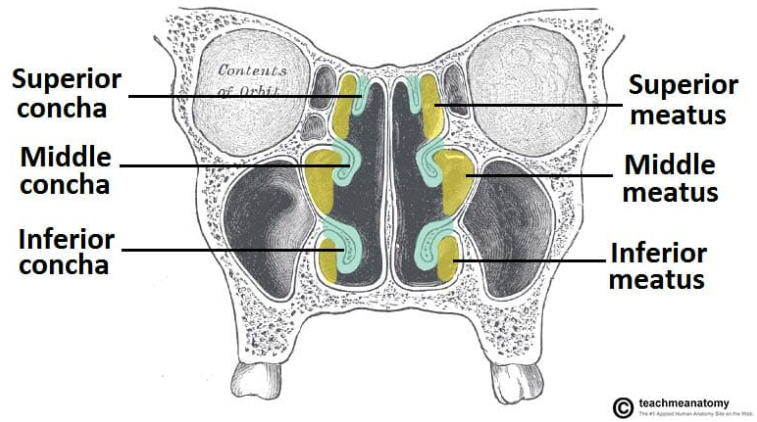
  

## Kyyneltiehyt avautuu nenäontelon yläkäytävään

  <button class="solution-button" data-label="Vastaus" data-hide-label="Piilota vastaus">
    Vastaus
  </button>
  

      V

Kyyneltiehyt avautuu alakäytävään. 

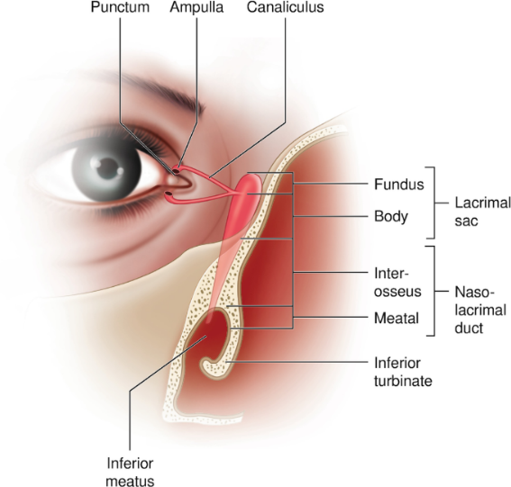

  

## Johtumistyyppisessä kuuloviassa Weberin testi lateraalistuu terveeseen korvaan ja Rinnen testissä on negatiivinen sairaassa korvassa

  <button class="solution-button" data-label="Vastaus" data-hide-label="Piilota vastaus">
    Vastaus
  </button>
  

      V

Konduktiivisessa kuuloviassa Weber lateraalistuu sairaaseen korvaan, koska konduktiivinen vika tekee sisäkorvan sensitiivisemmäksi luuvälitteiselle äänelle ja siten ääni aistitaan voimakkaampana sairaan korvan puolella. 

  

## Poskiontelon luonnollinen aukko nenäonteloon sijaitsee keskikäytävässä

  <button class="solution-button" data-label="Vastaus" data-hide-label="Piilota vastaus">
    Vastaus
  </button>
  

      O

Parillisen poskiontelon (sinus maxillaris) leveys on aikuisella n. 2,5 cm ja syvyys n. 3,5 cm ja kokonaistilavuus noin 15 ml. Luonnollinen aukko nenään (ostium) sijaitsee ontelon ylämediaaliosassa ja on läpimitaltaan 2–5 mm. Nenäkäytävän puolelle ostium avautuu keskikuorikon alle ostiomeataalisen yksikön alueelle. Poskiontelosta voi olla nenään myös yksi tai useampi ylimääräinen aukko, ns. akkessorinen ostium.

  

## Nenän ahtain kohta, ns. valvula-alue sijaitsee 1,5-2 cm sierainaukosta

  <button class="solution-button" data-label="Vastaus" data-hide-label="Piilota vastaus">
    Vastaus
  </button>
  

      O

Nenähengityksen kannalta tärkeä alue sijaitsee nenän etuosassa n. 1,5–2 cm sierainaukosta. Tämän kolmionmuotoisen nenän ahtaimman kohdan, ns. valvula-alueen, rajaavat septum, ylälateraaliruston alareuna, alakuorikon etureuna ja nenäkäytävän pohja. Valvula-alueen ahtautuminen (esim. valvulainsuffisienssissa, jossa on sieraimen lateraaliseinämän rustojen vajaatoimintaa, jonka seurauksena valvula-alue painuu sisäänhengityksen aiheuttaman alipaineen seurauksena sisäänpäin (Bernoullin laki)) heikentää nenän ilmavirtausta.

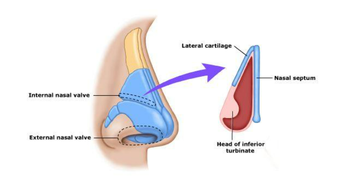
  

## Aikuisilla sivuonteloiden koossa voi olla huomattaviakin yksilökohtaisia eroja

  <button class="solution-button" data-label="Vastaus" data-hide-label="Piilota vastaus">
    Vastaus
  </button>
  

      O

Onteloiden kasvunopeus ja lopullinen koko on yksilöllistä. Sivuontelot saavuttavat lopullisen kokonsa 15–18 vuoden ikään mennessä.
  

## Parilliset otsaontelot (sinus frontalis) alkavat kasvaa vasta aikuisiällä

  <button class="solution-button" data-label="Vastaus" data-hide-label="Piilota vastaus">
    Vastaus
  </button>
  

      V

Alkavat kasvaa vasta **kouluiässä.** Niiden koko vaihtelee suuresti ja ne voivat myös puuttua tois- tai molemminpuolisesti.
  

## Nenänielun etuseinämän keskeinen rakenne on kaarenmuotoinen torus tubarius, jonka keskellä on korvatorven, tuba auditivan aukko

  <button class="solution-button" data-label="Vastaus" data-hide-label="Piilota vastaus">
    Vastaus
  </button>
  

      V

Kyseessä on nenänielun sivuseinämän keskeinen rakenne. Se on nasofarynxin mukoosapinnan kohouma, joka muodostuu korvatorven rustoisen osan tyvestä. Sen tehtävänä on suojata korvatorven aukkoa.

  

## M. tensor ja levator veli palatinin supistuminen niellessä tai haukotellessa avaa korvatorven suuta ja silloin ilmaa pääsee välikorvaan

  <button class="solution-button" data-label="Vastaus" data-hide-label="Piilota vastaus">
    Vastaus
  </button>
  

      O

  

## Infraorbitaalihermo kulkee silmäkuopan luisessa pohjassa ja tulee luukanavastaan ulos silmäkuopan alareunassa.

  <button class="solution-button" data-label="Vastaus" data-hide-label="Piilota vastaus">
    Vastaus
  </button>
  

      O

Keskikasvon alueen tuntohermo on n. infraorbitalis, joka on n. maxillariksen haara.

Sijaintinsa vuoksi infraorbitaalihermo on alttiina vaurioitumiselle esimerkiksi kasvovammojen ja leikkausten yhteydessä.

Silmäkuopan luinen pohja on samalla poskiontelon katto. 

  

## Parasympaattinen hermoärsytys aiheuttaa vasokonstriktion ja nenän limakalvon supistumisen

  <button class="solution-button" data-label="Vastaus" data-hide-label="Piilota vastaus">
    Vastaus
  </button>
  

      V
      
Nenäontelossa on hyvin runsas parasympaattisten ja sympaattisten hermosäikeiden verkosto.

_Sympaattinen_ hermoärsytys aiheuttaa vasokonstriktion ja nenän limakalvon supistumisen. _Parasympaattinen_ aktivaatio lisää nenän limakalvon eritystoimintaa ja laajentaa verisuonia. 
  

## Nenän sivuonteloiden runsas verenkierto tulee sekä a. carotis internasta että a. carotis externasta

  <button class="solution-button" data-label="Vastaus" data-hide-label="Piilota vastaus">
    Vastaus
  </button>
  

      O

A. carotis internasta tulevan a. ophthalmican haarat a.ethmoidalis anterior ja posterior huolehtivat nenän ylä- ja etuosien verenkierrosta. 

Keskikuorikon takapään kohdalla sijaitsevan foramen sphenopalatinumin kautta nenään tuleva a.sphenopalatina suonittaa suunnilleen keskikuorikkotason alapuolelta nenänkäytävien ala- ja takaosaa. Tämä valtimo on merkityksellinen vaikeiden nenäverenvuotojen hoidon kannalta. 

Nenän valtimoiden välillä on runsaasti anastomooseja. Nenän väliseinän etuosassa on tiivis verisuoniverkosto ns. locus Kiesselbachin alueella. 

Laskimoiden kulku seuraa pääosin valtimoita. Laskimot ovat läpättömiä, ja osa niistä laskee sinus cavernosukseen. Siten nenän ja sivuonteloiden alueen infektio voi levitä joskus kallon sisälle.

  

## Nenän limakalvon pinta on värekarvallista lieriöepiteeliä

  <button class="solution-button" data-label="Vastaus" data-hide-label="Piilota vastaus">
    Vastaus
  </button>
  

      O

Samoin sivuonteloiden limakalvo. 

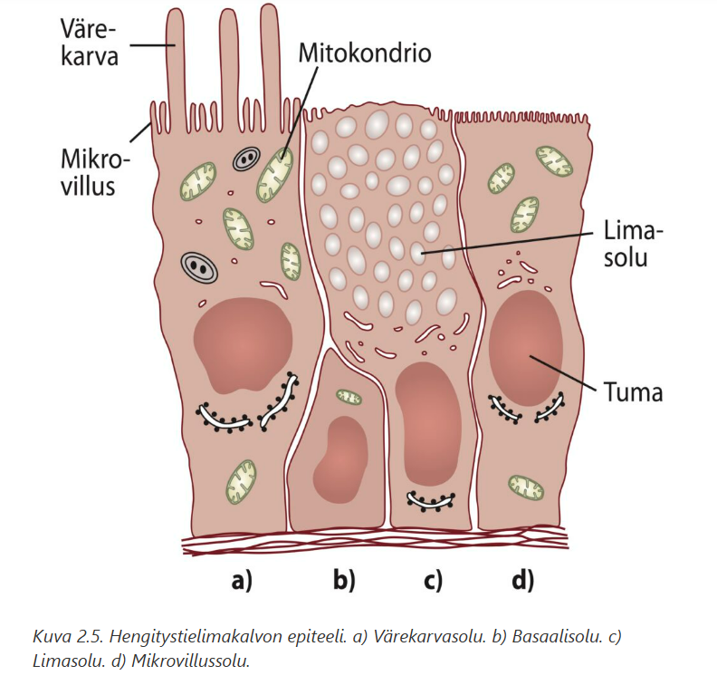

  

## Nenäkäytävien pohjalla sijaitsevan hajuepiteelin pinta-ala on noin 5 cm2

  <button class="solution-button" data-label="Vastaus" data-hide-label="Piilota vastaus">
    Vastaus
  </button>
  

      V

Hajuepiteelin pinta-ala kylläkin on n. 5cm2, mutta se sijaitsee nenäkäytävien katossa lamina cribrosan ja keski- sekä yläkuorikon yläosan alueella. 

Hajuepiteelissä on olfaktorisia sensorineuroneita. Hajumolekyylit liukenevat mukoosapinnan eritteisiin ja sitoutuvat reseptoreihin, mikä johtaa hajusignaalin syntymiseen. 

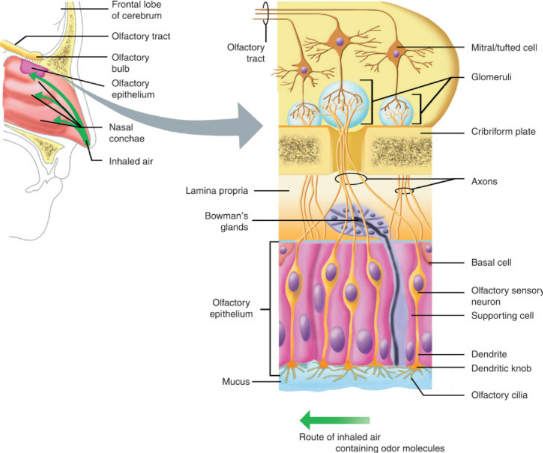
  

## Vastasyntynyt ei pysty hengittämään suun kautta ja avoin nenä on sen vuoksi elintärkeä

  <button class="solution-button" data-label="Vastaus" data-hide-label="Piilota vastaus">
    Vastaus
  </button>
  

      O

Tämä on jokseenkin harhaanjohtava kommentti kirjassa. Vastasyntyneet ovat ns. preferentiaalisia nenähengittäjiä eli he hengittävät luonnollisesti nenän kautta ja suun kautta hengitetään vain tietyissä tilanteissa (esim. itkiessä tai nenän tukkeutuessa). Tietystihän vastasyntyneetkin pystyvät täydellisessä nenäokkluusiossa hengittämään suun kautta, mutta tämä on vain merkittävästi vaikeampaa ja kuluttavampaa vastasyntyneille kuin vanhemmille lapsille. Yleensä vauva itkee enemmän nenän tukkeutuessa ja itkiessään vauva hengittää suun kautta. Jos pienet vauvat eivät pystyisi tarpeen tullessa hengittää suun kautta, niin jokainen ylähengitystieinfektion saanut vauva, jonka nenä tukkeutuu, jouduttaisiin intuboimaan. 

Vastasyntyneet kuitenkin välttävät suuhengittämistä, koska he alitajunnassaan tietävät sen johtavan leuan alikehittymiseen. 
  

## Aamulla herätessä ilmenevä nenäntukkoisuus on aina merkki sairaudesta

  <button class="solution-button" data-label="Vastaus" data-hide-label="Piilota vastaus">
    Vastaus
  </button>
  

      V

Aamulla herätessä ilmenevä nenäntukkoisuus on fysiologista ja helpottuu ylösnoustua. Tämä johtuu siitä, että makuuasennossa limakalvoturvotus lisääntyy; kyljellä nukuttaessa enemmän alempana olevassa nenäontelossa.  
  

## Nenän fysiologiaan kuuluu noin 80 % ihmisistä nenäsykli, jossa nenäonteloiden limakalvoturpeus vaihtelee puolelta toiselle parin tunnin välein

  <button class="solution-button" data-label="Vastaus" data-hide-label="Piilota vastaus">
    Vastaus
  </button>
  

      O

Myös nenän mukosiliaaritoiminnassa havaitaan nenäsyklin aiheuttama puoliero. Hypotalamuksen säätelemänä autonominen hermosto ohjaa nenäontelon verisuonien konstriktiota ja dilataatiota siten, että välillä toinen puoli nenäontelosta on enemmän tukossa ja taas välillä se on enemmän auki. **Ajatellaan, että tällä on merkitystä limakalvon toipumisen kannalta.**

Nenäsykli näkyy myös nenän virtausvastuksen voimakkuuden vaihteluna puolelta toiselle. Nenän kokonaisvirtausvastus säilyy kuitenkin tasaisena. 

  

## Välikorvan, korvatorven, nenän ja sen sivuonteloiden sekä alempien hengitysteiden limakalvon epiteelikerros koostuu pääasiassa värekarvallisista lieriösoluista

  <button class="solution-button" data-label="Vastaus" data-hide-label="Piilota vastaus">
    Vastaus
  </button>
  

      O

Kussakin värekarvasolussa on noin 200 värekarvaa, siliaa (cilia). Värekarvasolujen päällä on limakerros.

  

## Hengitysteiden limakalvon mukosiliaari- eli limankuljetustoiminnan häiriö on aina synnynnäinen

  <button class="solution-button" data-label="Vastaus" data-hide-label="Piilota vastaus">
    Vastaus
  </button>
  

      V

Useimmiten taustalla on hankittu syy, esim. krooninen riniitti/rinosinuiitta, tulehdukselliset alahengitystiesairaudet yms. Nämä hidastavat mukosiliaarista kuljetusta (hengitysteiden värekarvasolujen värekarvojen liikehdintää, joka kuljettaa haitallisia aineita pois hengitysteistä). Hyvä esimerkki tästä on viruspneumonia, joka altistaa bakteeripneumonialle osin siitä johtuen, että viruspneumonia vaurioittaa mukosiliaarista eskalaattoria ja täten bakteereita pystyy tarttua ja kertyä keuhkon mukoosapinnoille helpommin. 

Synnynnäiset syyt ovat harvinaisia, ja niistä tavallisin on liikkumattomien värekarvojen oireyhtymä (immotile cilia syndrome tai primary ciliary dyskinesia). Tämän yleisyys on noin 1:20 000. Hengitystieoireet alkavat pian syntymän jälkeen. Iän myötä kehittyy usein täydellinen Kartagenerin (Siewertin) oireyhtymä, jossa situs inversukseen (sisäelimet ovat järjestyneet peilikuvana normaaliin nähden) liittyvät krooniset poskiontelotulehdukset ja bronkiektasiatauti. Vaikeissa tulehduksellisissa hengitystiesairauksissa synnynnäinen värekarvojen toimintahäiriö tulisi muistaa. Värekarvojen poikkileikkauksissa havaitaan täydellinen dyneinihaarakkeiden puutos. Miehet voivat olla infertiilejä, koska myös siittiöiden liike on huomattavasti alentunut.

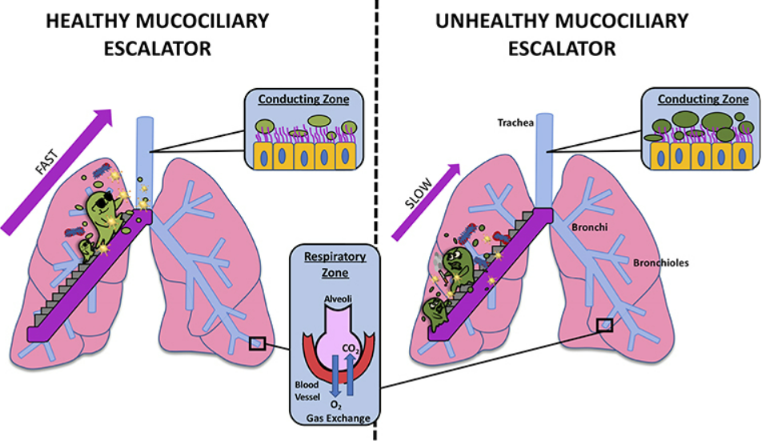
  

## Hajuaistin häiriö voi joskus olla Alzheimerin taudin ensimmäisiä oireita

  <button class="solution-button" data-label="Vastaus" data-hide-label="Piilota vastaus">
    Vastaus
  </button>
  

      O

Hajuaistin häiriöt voivat liittyä ylähengitysteiden sairauksiin, kuten krooniseen polypoottiseen rinosinuiittiin tai hermostoperäisiin häiriöihin. 

Alzheimerin tauti voi vaurioittaa mm. bulbus olfactoriusta ja siten häiritä hajuaistia. 

Alzheimerin taudin lisäksi mm. Parkinsonin taudissa, MS-taudissa ja Lewyn kappale -dementiassa voi esiintyä hajuaistin häiriöitä. 
  

## Leuan- ja kielenalussylkirauhasten tiehyet avautuvat posken limakalvolle

  <button class="solution-button" data-label="Vastaus" data-hide-label="Piilota vastaus">
    Vastaus
  </button>
  

      V

Suuria sylkirauhasia on kolme paria: leuanalussylkirauhaset, kielenalussylkirauhaset ja parotisrauhaset. Pieniä sylkirauhasia on kaikkialla suun limakalvoilla. 

Avautuvat suupohjan etuosaan. Korva-sylkirauhanen (glandula parotis, parotisrauhanen) taas avautuu posken limakalvolle yläposkihampaiden kohdalle.  

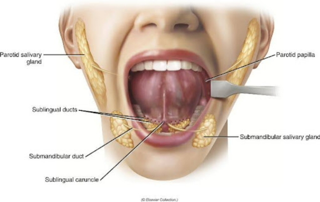
  

## Suun limakalvo on kerrostunutta lieriöepiteeliä

  <button class="solution-button" data-label="Vastaus" data-hide-label="Piilota vastaus">
    Vastaus
  </button>
  

      V

Suun limakalvo on kerrostunutta _levyepiteeliä._  

Se sisältää satoja pieniä limakalvonalaisia sylkirauhasia. Limakalvossa on herkkä kipu-, kosketus- ja lämpötunto. Leukaluiden alveoliharjanteiden ja kovan suulaen limakalvo on kiinnittynyt tiukasti alustaansa poikittaisjuosteisen mukoperiostin avulla. Poskien ja suunpohjan limakalvo kiinnittyy löyhästi alla oleviin kudoksiin.

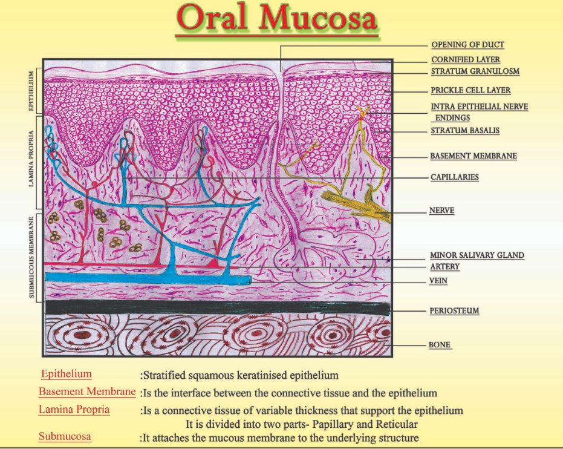
  

## Vallecula epiglottidis sijaitsee sijaitsee kielen tyven ja kurkunkannen välissä

  <button class="solution-button" data-label="Vastaus" data-hide-label="Piilota vastaus">
    Vastaus
  </button>
  

      O

Vallecula epiglottidis/epiglottica tarkoittaa parillisia kuoppia, jotka toimivat "syljen ansana", jossa sylki ja ruoka pysähtyvät hetkellisesti, estäen nielemisrefleksiä käynnistymästä ennen aikojaan.

On myös mahdollinen tunnistettavissa oleva maamerkki intubaatiossa. 

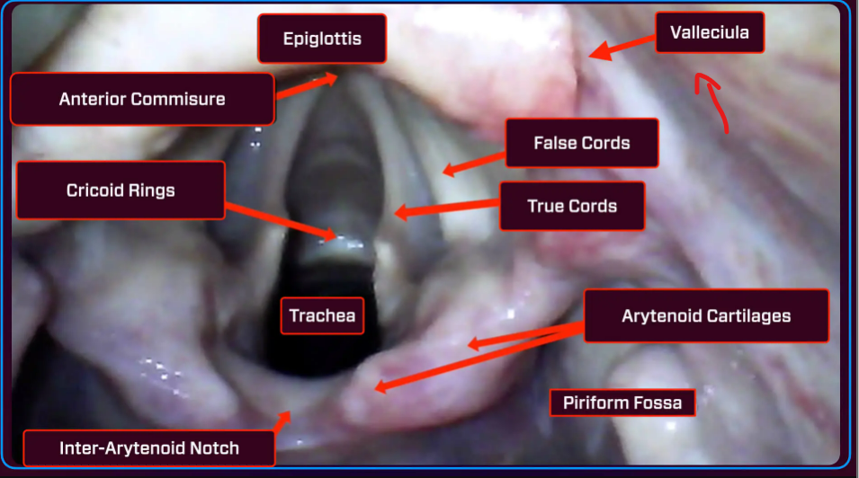
  

## Nielun katossa sijaitsee kitarisa

  <button class="solution-button" data-label="Vastaus" data-hide-label="Piilota vastaus">
    Vastaus
  </button>
  

      O

Kitarisa (adenoid) sijaitsee nenän takana nenänielussa. Ovat osa immuunipuolustusta ja alueen immuunisolut nappaavat ja tunnistavat patogeeneja, jotka pääsevät suun tai nenän kautta nieluun. 

Nielurisat (tonsils) taas sijaitsevat kielen molemmin puolin nielun sivuseinissä ja näkyvät suoraan suuhun katsottaessa. 

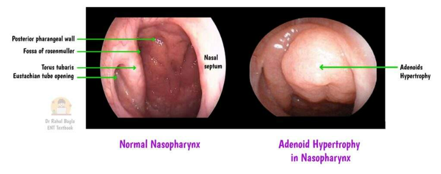
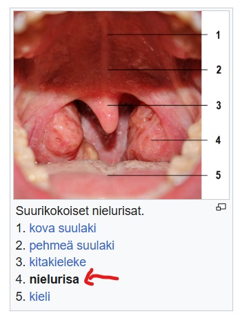
  

## Kurkunpään tehtävänä on suojata hengitysteitä vieraalta materiaalilta sekä mahdollistaa äänen tuottaminen

  <button class="solution-button" data-label="Vastaus" data-hide-label="Piilota vastaus">
    Vastaus
  </button>
  

      O

Kurkunpää = larynx 

Epiglottis (kurkunkansi) suojaa henkitorven aukon niellessä, mikä suojaa hengitysteitä ja estää aspiraatiota. 

Larynxissa on myös äänihuulet, jotka tuottavat ääntä fonaatiossa.

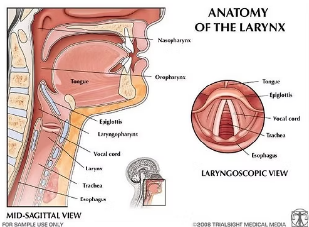
  

## Sormusruston (rengasrusto, cartilago cricoidea) ja kilpiruston (cartilago thyroidea) etuosien välissä sijaitsee ligamentum cricothyroideum

  <button class="solution-button" data-label="Vastaus" data-hide-label="Piilota vastaus">
    Vastaus
  </button>
  

      O

Tänä ligamentti estää näitä rustoja liikkumasta liian kauas toisistaan. Se leikataan hätäkrikotyreotomiassa, jos on ylähengitysteiden obstruktio ja ilmatien avaaminen ei ole muuten onnistunut. 

  

## Henkitorvi on kapeimmillaan sormusruston kohdalla

  <button class="solution-button" data-label="Vastaus" data-hide-label="Piilota vastaus">
    Vastaus
  </button>
  

      O

Tällä on merkitystä vierasesineiden tarttumisen ja hengitysteiden ahtaumien kannalta.

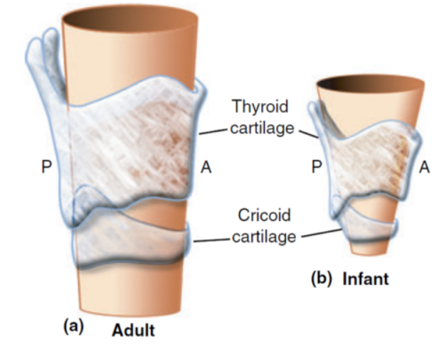
  

## Kurkunpäätä hermottavan nervus vaguksen haara nervus recurrens kiertää oikealla aortankaaren ja palaa kurkunpäähän

  <button class="solution-button" data-label="Vastaus" data-hide-label="Piilota vastaus">
    Vastaus
  </button>
  

      V

N. recurrens kulkee molemmin puolin kaulavaltimon rungon vieressä ja kiertää _oikealta a. subclavian_ alta kurkunpäähän. _Vasemmalla puolella_ n. recurrens kiertää aortankaaren. 

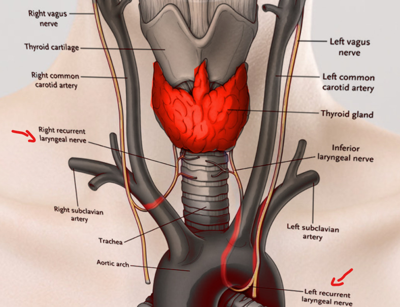
  

