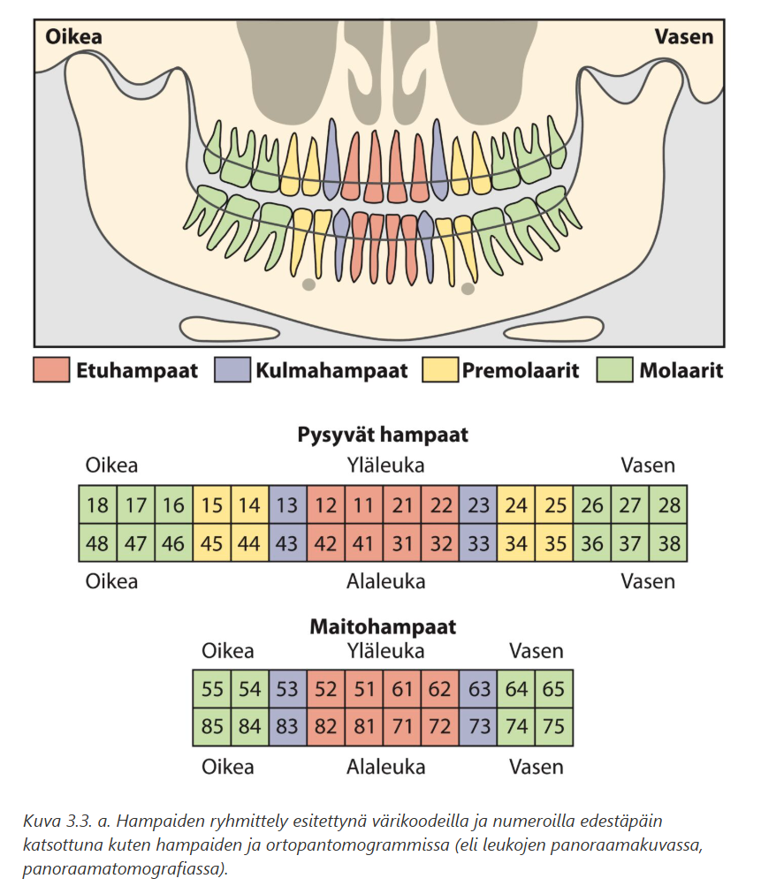
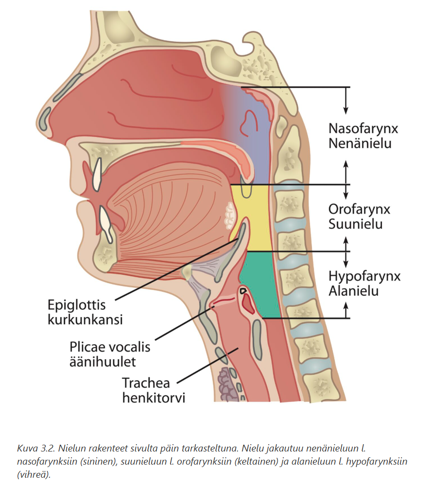
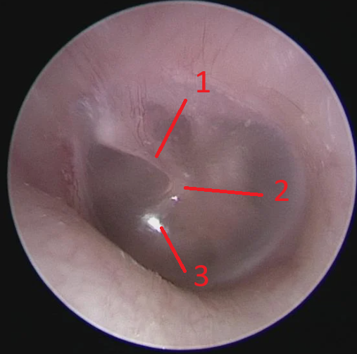
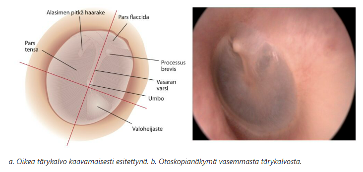

# 2026 

Kysymyspankki käytännössä muuttumaton vuosista 2016 ja 2021, mutta sekana voi olla yksittäisiä uusia kysymyksiä, jotka on alle listattu. Joitakin aikaisempia kysymyksiä löytyy myös päinvastaisessa asetelmassa kuin ennen, mutta ne tulisi olla helppoja huomata. 

## Taskuhuulet osallistuvat äänentuotantoon

  <button class="solution-button" data-label="Vastaus" data-hide-label="Piilota vastaus">
    Vastaus
  </button>
  

      V/O
      
Taskuhuulilla on iso merkitys kurkunpään sulkemisessa, mutta ei normaalisti äänentuotossa. Ne kuitenkin voivat osallistua epänormaaliin fonaatioon tuottamalla karkeampia ja murisevia ääniä -> kysymys on hieman huonosti sanoitettu. 
  

## Pysyviä hampaita on yleensä 32

  <button class="solution-button" data-label="Vastaus" data-hide-label="Piilota vastaus">
    Vastaus
  </button>
  

      O
      

  

## Nielu jaetaan kolmeen anatomiseen alueeseen 

  <button class="solution-button" data-label="Vastaus" data-hide-label="Piilota vastaus">
    Vastaus
  </button>
  

      O
      
Nielu jaetaan nenänieluun (nasopharynx), suunieluun (oropharynx) ja alanieluun (hypopharynx). Nielu (pharynx) ulottuu kallonpohjasta rengasrustotasoon.

  

## Taas tärykalvon rakenteiden tunnistamista, tällä kertaa vasemmasta korvasta 

  <button class="solution-button" data-label="Vastaus" data-hide-label="Piilota vastaus">
    Vastaus
  </button>
  

      Alla

1 = Vasaran varsi 
2 = Umbo 
3 = Valoheijaste

  

